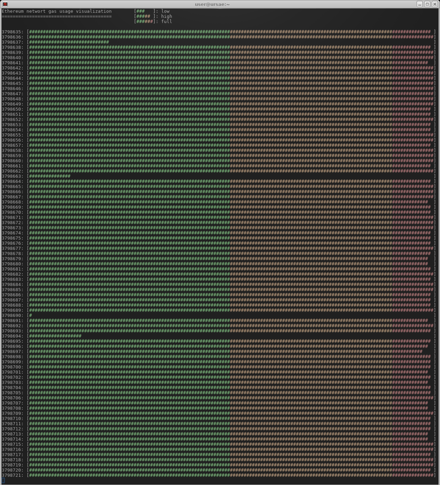

# gas-usage.rb
monitor ethereum network gas usage on the command line with ruby

### Dep

    gem install ethereum.rb ruby-terminfo colorize
    
### Run

    ruby gas-usage.rb
    
### Vis

### Hi!

(C) 2017 Afri 5chdn, please check the GPLv3 attached
